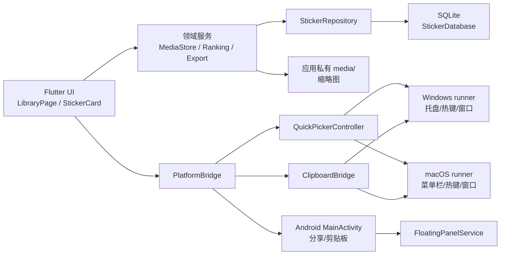

# 表情管家架构说明

## 1. 分层关系



Flutter 业务层不直接依赖具体平台 API。`StickerRepository` 和 `ImportSource` 是可替换边界，为未来的同步仓库或其他导入来源保留接口。

## 2. Flutter 层

### UI 与状态

- `lib/main.dart` 负责平台初始化和应用启动；`lib/ui/app_theme.dart` 定义共享视觉参数。
- `lib/ui/library_page.dart` 的 `LibraryPage` 协调分组、搜索、排序、导入和管理动作。页面通过 `StickerRepository` 读取数据，默认使用 `StickerDatabase`；测试可提供内存仓库，因此无需访问用户数据库。
- `LibrarySidebar` 展示分组及全量计数；`LibraryToolbar` 在窄窗口中将搜索和操作分行，多选操作改用带说明的图标。主管理正文使用系统安全边距。
- `StickerGrid` 负责网格、滚动和框选，`GridMetrics` 为渲染、命中判断及键盘定位提供同一组尺寸。排序和数据刷新后，页面按表情 ID 恢复焦点；表情离开当前结果时选择有效位置。
- `StickerCard` 负责缩略图回退、GIF 悬停播放、置顶标记和桌面右键菜单。选择状态使用青绿色边框与勾选，键盘焦点使用独立深色轮廓。快捷键监听仅位于网格范围，并要求网格自身拥有输入焦点。
- 网格使用 `UsageRankingService` 的结果；默认规则保留普通分组的使用排序和 QQ 收藏的来源顺序，显式选择最近导入时按创建时间降序排列。
- `LibraryFeedback` 展示短暂操作结果与独立进度提示。主管理和快速选择窗口共用加载失败说明与重试界面。

卡片单击使用 `PlatformBridge.useSticker`；悬停复制按钮使用 `PlatformBridge.copySticker`，仅写入剪贴板。Windows 两个入口共用互斥锁，因此独立复制不会覆盖正在发送的图片。仅复制不增加 Windows 使用次数；macOS 和 Android 成功复制计入使用次数。

### 领域服务

- `MediaStore`：读取文件、文件签名识别、SHA-256 去重、复制托管媒体、批量提交记录、删除应用副本、后台生成和升级缩略图。
- `UsageRankingService`：先按分组和查询过滤，再应用普通分组或 QQ 收藏排序规则。
- `ExportPackageService`：把数据库元数据与媒体写入版本化归档，调用 `EncryptedPackageCodec` 加密；导入时校验 manifest 和媒体哈希后恢复。
- `AppPreferences`：热键配置、剪贴板兼容性记录和网格密度使用本地偏好存储；密度支持标准与紧凑，缺失或未知字符串恢复为标准。

导入的并发边界是准备阶段最多 4 个 worker，缩略图阶段最多 2 个 worker；每个文件最多 64 MiB、每批最多 512 MiB，数据库提交使用单个事务。`onRecordsCommitted` 用于让 UI 在缩略图完成前刷新卡片。

## 3. 持久化层

`StickerDatabase` 使用 `sqflite_common_ffi`（Windows、macOS）或 SQLite（Android），当前 schema 版本为 3，缩略图生成器版本为 2。

```text
stickers
  id TEXT PRIMARY KEY
  hash TEXT UNIQUE
  media_type, file_path, thumbnail_path, thumbnail_version
  source, note, created_at, updated_at, last_used_at
  usage_count, is_pinned, source_order

groups
  id TEXT PRIMARY KEY, name TEXT UNIQUE, created_at

sticker_groups
  sticker_id + group_id PRIMARY KEY
```

数据库启动时创建 `all/全部` 和 `qq_favorites/QQ收藏`。删除操作显式清理关联表，不依赖每个 SQLite 驱动都开启外键。批量插入按 `hash` 忽略重复记录，同时为重复媒体补齐新分组关系；成功使用后按事务更新计数和最近使用时间。

媒体文件名以完整哈希命名，图片使用 `.image`，GIF 使用 `.gif`；缩略图以哈希命名为 PNG。删除服务只允许删除应用媒体目录下的文件，防止误删源目录。

## 4. Windows 调用链

### 启动与单实例

`windows/runner/main.cpp` 创建命名互斥体 `Local\StickerManager.SingleInstance`。重复启动等待首个窗口就绪并激活它，同时发送恢复主管理模式的窗口消息，然后退出，不创建第二个 Flutter 窗口。主窗口关闭消息被解释为隐藏到托盘；托盘退出动作才结束进程。

### 托盘与热键

`QuickPickerController` 初始化托盘图标、上下文菜单和 `Ctrl+Shift+E` 全局热键。热键触发顺序为：

1. runner 在 `WM_HOTKEY` 消息到达 `FlutterWindow::MessageHandler` 时同步记录外部顶层窗口快照；Dart 回调通过带 `fromHotKey` 的 `captureExternalWindow` 消费这份快照。
2. 显示并聚焦 Flutter 窗口，切换快速选择模式。
3. 选择表情后由 `PlatformBridge._useWindows` 写剪贴板、激活目标、发送 `Ctrl+V`/`Enter`，清理一次性目标句柄。

托盘图标左键/双击走主管理完整窗口；runner 在托盘左键按下消息处同步记录外部前台窗口，抬起消息只作兜底，再由 Dart 消费 pending 快照后显示并聚焦窗口，因此完整窗口卡片单击可以复用该 one-shot 目标。Windows tray_manager 将双击报告为两次鼠标事件，原生和控制器都在 800ms 内合并，避免第二次事件清除首个目标。右键显式弹出上下文菜单，其中“打开表情管家”走纯管理入口并清除目标。退出路径注销热键、移除监听、销毁托盘并结束进程，避免留下全局资源。

### 目标窗口快照、重解析与激活验证

runner 保存两类状态：前台事件的短期候选，以及当前快速发送的冻结目标。冻结目标包括原窗口的进程 PID、窗口类名、标题和当时的 HWND；后续前台事件只更新候选，不改写冻结字段。pending 快照有时效限制，避免异步 Dart 回调消费到过期窗口。

QQNT 的编辑控件可能在打开快速面板期间销毁并创建新的 HWND。`ResolveExternalWindow` 先把候选归一化为顶层窗口，确认仍属于原 PID 并校验冻结的窗口类名；原 HWND 允许标题自然变化，替代 HWND 必须保留冻结标题。候选失效时，`EnumWindows` 只搜索该 PID 的可见窗口，先要求冻结的类名和标题精确匹配；标题变化时仅在同类窗口唯一的情况下使用替代窗口。多个同类窗口无法确定时直接报告失败，避免把按键送到同进程的其他窗口。

`ActivateWindow` 在发送前恢复最小化窗口、附加输入线程并循环调用 `BringWindowToTop`、`SetActiveWindow` 和 `SetForegroundWindow`，最多短暂重试 12 次。只有 `GetForegroundWindow` 的顶层句柄确实等于解析后的目标时才返回成功；Dart 只有在该结果为真时才发送粘贴和回车，失败会清理一次性目标并报告失败。Windows 卡片使用流程由异步互斥串行化，避免并发点击覆盖全局剪贴板或互相消费发送目标。

### 剪贴板与窗口激活

runner 的 `flutter_window.cpp` 通过 GDI+ 解码静态图并写入 `CF_DIB`/`CF_BITMAP`；GIF 写入包含原路径的 `CF_HDROP`。`SendInput` 发送粘贴和回车。目标窗口捕获会把子控件归一化为顶层窗口，并在激活时短暂附加输入线程，适配 QQNT 编辑器等子窗口。若原 HWND 已重建，按冻结 PID/类名/标题重解析后再做前台验证。

右键菜单的“打开表情管家”会清除一次性目标；托盘图标左键/双击入口则在显示完整窗口前捕获当前或 5 秒内的最近外部窗口，并将其冻结为本次 one-shot 目标。原生层会忽略 `Shell_TrayWnd`、通知区域溢出窗口和桌面壳窗口，防止托盘点击过程把任务栏误识别为目标。主管理界面的“快速唤出”按钮同样可明确请求复用最近外部窗口；快照必须仍在 5 秒有效期内、句柄有效且属于外部进程，随后冻结为本次目标。超过有效期或没有目标时直接返回空目标，避免从 Z 序误选其他应用。

## 5. Android 调用链

`MainActivity.kt` 注册 `sticker_manager/platform` MethodChannel 和 `sticker_manager/share_events` EventChannel：

- `ACTION_SEND`/`ACTION_SEND_MULTIPLE` 接收图片 URI，复制到应用 cache，按 action、MIME、URI 集合生成指纹，持久化待导入队列；Flutter 成功确认后调用 `ackSharedFiles` 清理。
- 分享复制使用 64 KiB 缓冲区和 64 MiB 单文件、512 MiB 批次上限；超限或读取失败原因持久化到队列，并由 Flutter 在下次打开时提示。
- `pasteSticker` 通过 `FileProvider` 生成 URI，写入 Android `ClipboardManager`。
- 悬浮面板相关方法检查 overlay 权限、同步最多 100 条排序结果、启动或停止前台服务。

`FloatingPanelService.kt` 是唯一的悬浮服务实例，使用 `TYPE_APPLICATION_OVERLAY` 显示气泡和横向面板。服务启动请求有锁和幂等保护；点击成功复制后记录待合并使用事件，主界面回到前台时确认这些事件。

Android Manifest 只声明图片分享过滤器、overlay/前台服务权限和 `FileProvider`，不请求读取 QQ/微信私有目录权限。

## 6. 迁移格式

`ExportPackageService` 先构造 ZIP：

```text
manifest.json
media/<hash>.(image|gif)
thumbnails/<hash>_thumb.png   # 可选
```

`manifest.json` 的 `formatVersion` 当前为 1，包含分组、每条表情的哈希、类型、来源、备注、时间、使用计数、置顶、源顺序和分组关系。`EncryptedPackageCodec` 使用 `SMP\x01` 魔数、16 字节随机盐、PBKDF2-HMAC-SHA256 120,000 次派生 AES-256-GCM 密钥；认证失败、密码错误、版本不支持或媒体哈希不一致都在创建记录前拒绝。

## 7. 测试边界

`test/` 覆盖模型序列化、排序与搜索、数据库迁移/分组/批量事务/使用计数、导入签名与缩略图、加密包往返/篡改/哈希校验、偏好设置。Windows 原生托盘、真实 QQ/微信窗口和 Android overlay 需要在对应设备上做集成验收；不能在纯 Flutter 单元测试中假设这些系统行为。

## 8. 扩展点

- 新数据后端实现 `StickerRepository`，不改变 UI 和导入服务契约。
- 新导入来源实现 `ImportSource`，保留“来源标记、预览确认、哈希去重”的流程。
- 新平台在 `PlatformBridge` 后增加剪贴板、分享和窗口适配，不把 Win32/Android 类型泄漏到领域模型。
- 迁移格式升版时保留旧版本读取器，并在 `DECISIONS.md` 和 `CHANGELOG.md` 记录兼容策略。

## macOS 平台实现

`macos/Runner/MainFlutterWindow.swift` 注册共享方法通道并写入 `NSPasteboard`。原生解码不支持的静态格式由 Flutter 解码后转换为 PNG。`AppDelegate` 保持关闭窗口后的进程，并在 Dock 重开时通知 Dart 恢复主管理模式。

`isDesktopPlatform` 只控制 Windows/macOS 共享的桌面界面与窗口行为。Windows 导入探测、HWND 操作、发送和兼容性记录保留独立条件。macOS 使用系统文件选择器。菜单栏直接读取 Windows ICO 资源，并显示原始颜色。macOS 应用图标由 Xcode scheme 在构建前调用 `tool/generate_macos_icons.sh`，使用系统 `sips` 从同一 ICO 生成 PNG；生成文件不纳入 Git。Windows/Android 构建和 Flutter 测试无需生成图标。
